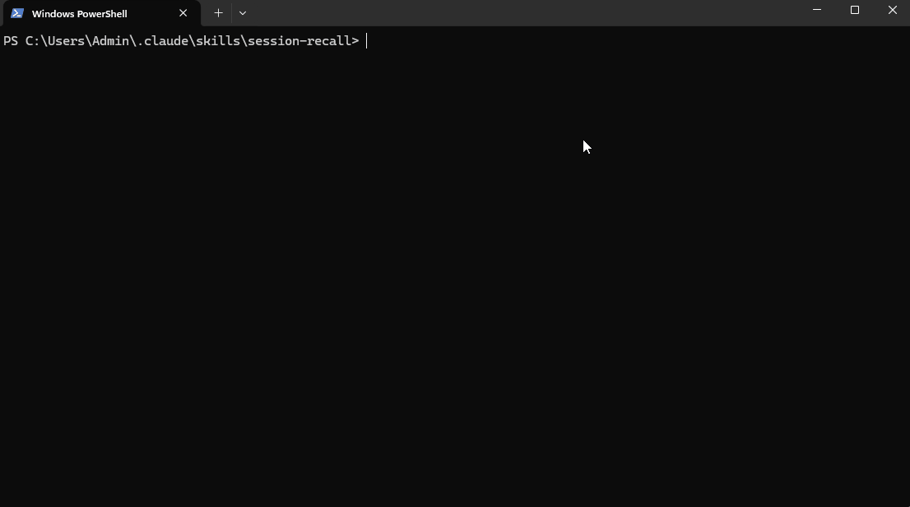

# session-recall

**Your AI coding session has been compacted. It did not tell you how many times, and it cannot tell
which of the things it "knows" it actually measured.**



Run it on your own session, before reading any further. Nothing is installed:

```bash
npx claude-session-recall compactions
```

Your numbers will be different. That is the point — they are *yours*, and nothing else was going to
tell you.

A Claude Code skill that reads the session's own transcript, so a fact that arrived through a
compaction summary can be checked instead of repeated.

---

## The problem

When a conversation is compacted, what survives into the next context window is a **summary**:
chosen, compressed and written by the assistant. The full record is not deleted — it stays in the
transcript on disk — but nothing points at it.

So a fact that arrived through a summary is **indistinguishable** from a fact that was measured. It
reads the same, it is stated with the same confidence, and it gets acted on the same way. Repeat
that through several compactions and a claim nobody ever checked becomes something everybody
believes.

## Find your own inherited claims

You do not have to guess what to look for. Ask what your last summary asserted:

```bash
node recall.mjs claims
```

```
  Summary #28 of 28, line 103216, 17,109 chars.
  16 sentence(s) in it assert something checkable.

  This is a starting list, not a verdict: a sentence here is not wrong, and one that is
  missing is not cleared. Trace the ones your next decision depends on.

   1. [version] ... the release chore is still pending ...
      recall trace "the release chore is still pending"
   ...
```

Then trace the one your next decision rests on. It prints the command for you:

```bash
node recall.mjs trace "the release chore is still pending"
```

Two answers are possible, and they look nothing alike.

**A claim with nothing behind it:**

```
  First stated in a compaction summary at line 103216.
  Occurrences in the record BEFORE that: 0

  THE SUMMARY IS THE ORIGIN. Nothing in the record measured this before a summary
  asserted it, so there is no evidence behind it in this session. Measure it now
  rather than repeating it.
```

**A claim that was actually established:**

```
  First stated in a compaction summary at line 95403.
  Occurrences in the record BEFORE that: 9

  It was in the record first, earliest at line 91905.
  Read it with:  recall around 91905
```

That distinction is the whole tool.

## Install

**Try it without installing anything:**

```bash
npx claude-session-recall compactions
npx claude-session-recall claims
```

**To give it to Claude Code as a skill** (so it reaches for it on its own):

```bash
git clone https://github.com/CavsSatyamKhatri/claude-session-recall.git \
  ~/.claude/skills/session-recall
```

That is the whole install. No dependencies, no build, no config, nothing running in the background —
just Node's standard library and a file you already have. Claude Code picks the skill up on the next
session, and `SKILL.md`'s description tells it when to reach for it.

## What runs where

The tool itself is **cross-platform**: `compactions`, `trace`, `claims`, `turns`, `find` and
`around` read a transcript, and that is the same on macOS, Linux and Windows.

The optional guards are not all universal, and it is better to say so than to have you find out:

| hook / guard | where it applies |
|---|---|
| `claims` on compaction (`post-compact.mjs`) | **everywhere** — nothing platform-specific in it |
| an `Edit` whose text is not in the file | **everywhere** — and it is the one that fires most |
| a backslash before a quote in a Python heredoc | everywhere |
| `/tmp` crossing between Git Bash and a Windows interpreter | Windows only |
| `&&` / `\|\|` in Windows PowerShell 5.1 | Windows only |

On macOS and Linux the two Windows guards simply never fire; they check `process.platform` and stay
out of the way.

## Commands

| | |
|---|---|
| `compactions` | how many times this session was compacted, when, and how much each summary carried |
| `claims [n] [max]` | what summary *n* asserts that can be checked, each with a ready-made `trace` |
| `trace "<text>"` | **the important one** — did the record contain this before a summary claimed it? |
| `turns [n]` | the last n things you asked for, with transcript line numbers |
| `find "<text>"` | every byte-exact occurrence, with surrounding context |
| `around <line>` | what was being worked on near that point |

`--file <path>` reads an older transcript instead of the live one.

It finds the live transcript by **modification time** — the `.jsonl` being appended to under
`~/.claude/projects/`. Not by deriving the folder name from the working directory: that folder is a
slug of the path whose casing is not consistent (`C--Users-Admin` sits beside `d--Projects-...`),
and a wrong guess reads somebody else's session.

## Three things to know before trusting the output

**`claims` is a heuristic and says so.** It looks for the shapes that go wrong in practice — a
version number, a count, and the words that quietly turn a past observation into a present-tense
claim: *still*, *remains*, *pending*, *already*. A sentence it flags is not guilty, and a sentence
it misses is not cleared. It exists to give you somewhere to start, not a verdict.

**Trace a claim, not a token.** Tracing a bare version string can return hundreds of hits from code
comments and build files, and tells you almost nothing. Trace the distinctive phrase that carries
the assertion. `claims` builds that phrase for you.

**Your own searching lands in the record.** Running `trace` writes that command into the transcript,
so occurrences *after* the summary can include the query itself. The output separates before and
after for exactly this reason — only the "before" count is evidence. This was found by testing, not
by reasoning: a search for a sentence that had never been said still returned one hit.

## The hook that runs `claims` for you

*Added after measuring the honest answer to "does the assistant reach for this on its own?" — **no**.
Installed, available, documented, and invoked **zero** times across a session of several hundred
megabytes.*

The reason turned out to be in the skill's own first paragraph. Its instruction said *use this when
a fact arrived through a summary rather than from something you measured* — and a summarised fact is
**indistinguishable** from a measured one. The trigger asked the assistant to notice exactly the
thing the tool exists because nobody can notice.

So `claims` now runs itself, at the one moment it is certainly relevant:

```bash
node hooks/install-hooks.mjs     # registers this and the guards below
```

Compaction happens → the hook runs `claims` → the new summary's checkable assertions arrive in
context, each with its `trace` command already written out. Nothing has to be remembered.

Three things it deliberately does:

- **Says nothing when there is nothing to say.** No compaction, or a summary that asserts nothing
  checkable, and it prints nothing at all. A hook that reports "nothing to report" every time is
  noise, and noise gets switched off — taking the working guards with it.
- **Caps the list at five.** This is a token cost paid on every compaction, and a wall of text is
  skimmed exactly like no text at all.
- **Can never fail a session.** Any error — a transcript it cannot read, a spawn that will not
  start — exits silently.

**It cannot be proved on demand, and that is stated rather than hidden.** A compaction is not
something a test can cause. `prove.mjs` proves the *script*: given a transcript it says the right
thing, given nothing worth saying it stays silent, and six claims are cut to five. It cannot prove
the *event*. So the hook logs every run to `~/.claude/session-recall-postcompact.log` — check that
file after your next compaction. Lines mean it fired; an empty file means the matcher is wrong, not
that there was nothing to say, because it logs its silences too.

## The guards (optional, and a different thing)

The hook above fixes an attention failure. There is a second kind, and it is not a memory failure
at all. Count it on your own record:

```bash
node recall.mjs errors
```

```
  Mechanical failures in this record - each one a round-trip that could not have worked:

       148   a script that could not parse            SyntaxError
       136   a command that is not on this machine    command not found
        66   /tmp meaning two different places        No such file or directory: '/tmp/
        62   unbalanced quoting in a shell command    unexpected EOF while looking for matching
        61   an Edit whose text was not in the file   String to replace not found
        61   a backslash inside a Python string       unterminated string literal
        18   && in Windows PowerShell                 is not a valid statement separator
       ...
```

Again, your numbers will differ — the shape is what matters. **Every one of these was already
covered by a rule that was present and was broken anyway.** The PowerShell one is the clearest case:
*"`&&` is not available in this version"* sits in the tool description on **every single request**.
It was still broken, repeatedly.

So the problem is not that a rule is missing, or hard to find, or badly worded. A rule has to be
*applied*, and attention is not reliable.

**That argument sat in this README for a while and was applied only to typos.** It was never turned
on the tool's own main feature, which is why the section above exists.

A hook does not need attention. It runs outside the assistant's judgement, before the tool call, and
refuses. `hooks/guard.mjs` refuses four things:

- **`/tmp` crossing interpreters** — Git Bash resolves `/tmp` inside its own install; a
  Windows-native `python`/`node` resolves it to `C:\tmp`. A file written by one and read by the
  other is simply not there.
- **A backslash before a quote in a Python heredoc** — `'\'` and `.replace('\','/')` are an
  unterminated literal or a silent escape.
- **`&&` or `||` in Windows PowerShell 5.1** — a parser error before anything runs.
- **An `Edit` whose text is not in the file** — and it names *why*: line endings, indentation, or
  the block having changed since it was read.

```bash
node hooks/install-hooks.mjs     # you run this, not the assistant
```

**You install it, deliberately.** A thing whose purpose is to limit the assistant's behaviour should
not be installed by the assistant — and it cannot be: writing your hook and permission settings is
refused, which is the correct design. The installer merges rather than replaces, backs the file up,
prints exactly what changed, and does nothing at all if your `settings.json` is not valid JSON.

```bash
node hooks/prove.mjs             # 15 cases: 5 refused, 6 allowed, 4 for the PostCompact hook
```

Run that before trusting it. **A guard that cannot be seen to refuse is not a guard — and one that
refuses the wrong thing is worse than none**, because it gets switched off within a week and takes
the working guards with it. The allow cases are there for that reason and matter as much as the deny
cases: ordinary `/tmp` use in bash, a heredoc with no backslash, PowerShell using `;`, an `Edit`
that really does match.

Two of those eleven cases failed the first two times it was run, and **both times the guard was
right and the test was wrong** — searching with *less* indentation than the file has still matches,
because the shorter run of spaces sits inside the longer one. That is the sort of thing only running
it tells you.

## What it deliberately is not

**It builds no index and caches nothing.** A transcript of several hundred million characters
searches in about two seconds. A stored summary of it would buy nothing measurable and would go
stale — which is the exact failure this exists to prevent. Reading the record directly cannot be
out of date.

**It never tells you whether a claim is true.** It tells you where the claim entered. The transcript
proves what was *said*, never what is *true now* — a version that was correct when it was written
may be wrong today. Where the running system can be asked, ask the running system; use this to find
out whether anyone ever did.

**It is not a memory system.** It does not persist anything between sessions, rank importance, or
decide what matters. It reads a file you already have.

## Why not just grep the transcript?

You can, and for a known string you should — it is the same file. What `trace` adds is the one
distinction grep cannot make: **whether an occurrence sits inside a compaction summary or in the
record itself**, and therefore whether a claim had any evidence behind it before a summary asserted
it. Compaction boundaries are marked in the transcript (`isCompactSummary`); this reads them.

## Where this came from

One long-running session, compacted 28 times. A summary carried a version number and the words
*"still pending"*. Both were wrong — the thing had already shipped — and the claim survived several
more compactions, was written into plans, and was repeated for hours before anyone thought to check
it. Tracing it afterwards took one command and showed zero occurrences in the record before the
summary that asserted it.

The number had never been measured. It had been inherited.

## Requirements

Node 18+. Nothing else.

## Licence

MIT.
